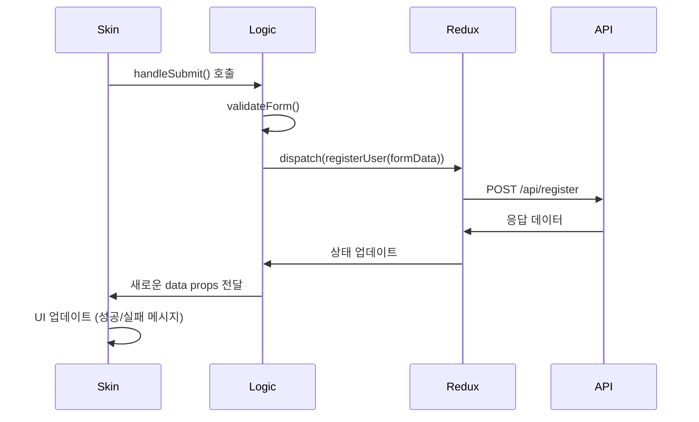
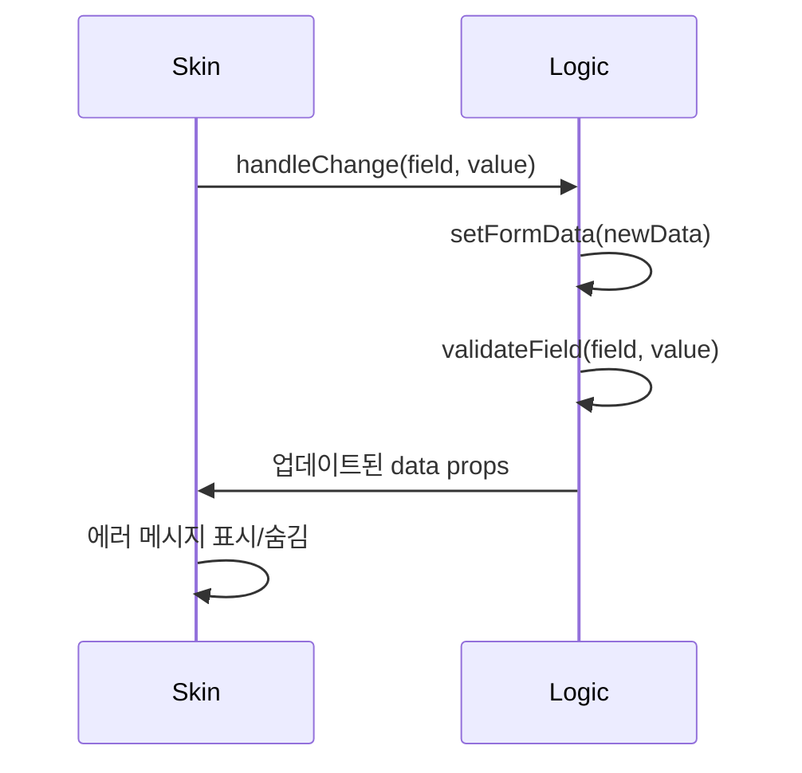

# 스킨에서 API 호출 처리 가이드

## 개요

WithCookie WebBuilder의 스킨 시스템에서 API 호출은 **스킨에서 직접 처리하지 않습니다**. 대신 Logic 레이어에서 제공하는 액션을 통해 처리됩니다.

## 아키텍처

```
┌─────────────┐    ┌──────────────┐    ┌─────────────┐    ┌─────────────┐
│   Skin UI   │◄──►│ Logic Layer  │◄──►│ Redux Store │◄──►│ API Service │
│             │    │ (useLogic)   │    │             │    │             │
└─────────────┘    └──────────────┘    └─────────────┘    └─────────────┘
     UI만 담당         비즈니스 로직        상태 관리         네트워크 요청
```

## ❌ 하지 말아야 할 것

### 1. 스킨에서 직접 API 호출
```jsx
// 잘못된 예시
const MySkin = ({ data, actions, utils }) => {
  const handleSubmit = async (e) => {
    e.preventDefault();
    
    // ❌ 스킨에서 직접 API 호출하지 마세요
    try {
      const response = await fetch('/api/signup', {
        method: 'POST',
        headers: { 'Content-Type': 'application/json' },
        body: JSON.stringify(formData)
      });
      const result = await response.json();
      // 직접 상태 관리 시도...
    } catch (error) {
      // 에러 처리...
    }
  };
  
  return <form onSubmit={handleSubmit}>...</form>;
};
```

### 2. 스킨에서 상태 직접 관리
```jsx
// 잘못된 예시
const MySkin = (props) => {
  const [loading, setLoading] = useState(false);
  const [error, setError] = useState(null);
  
  // ❌ 스킨에서 상태를 직접 관리하지 마세요
  // 이미 Logic에서 제공하는 상태를 사용하세요
};
```

## ✅ 올바른 방법

### 1. 제공된 액션 사용
```jsx
// 올바른 예시
const MySkin = ({ data, actions, options, utils }) => {
  const { t } = utils;
  
  // ✅ Logic에서 제공하는 데이터 사용
  const { 
    formData, 
    validationErrors, 
    loading, 
    signUpSuccess, 
    signUpError 
  } = data;
  
  // ✅ Logic에서 제공하는 액션 사용
  const { 
    handleChange, 
    handleSubmit, 
    handleBlur 
  } = actions;
  
  return (
    <form onSubmit={handleSubmit}> {/* 제공된 핸들러 사용 */}
      <input 
        id="user_id"
        value={formData.user_id || ''}
        onChange={handleChange} // 제공된 핸들러 사용
        onBlur={() => handleBlur('user_id')}
      />
      
      {validationErrors?.user_id && (
        <span>{validationErrors.user_id}</span>
      )}
      
      <button type="submit" disabled={loading}>
        {loading ? t('처리 중...') : t('회원가입')}
      </button>
      
      {signUpError && <div>{t(signUpError)}</div>}
      {signUpSuccess && <div>{t('회원가입 성공!')}</div>}
    </form>
  );
};
```

### 2. 커스텀 액션이 필요한 경우
만약 스킨에서 특별한 동작이 필요하다면, Logic 레이어를 수정해야 합니다:

```typescript
// SignupLogic.ts에서 새로운 액션 추가
export const useSignupLogic = (componentData: ComponentData, mode: ComponentRenderMode) => {
  // ... 기존 로직
  
  // 새로운 커스텀 액션 추가
  const handleCustomAction = useCallback(async (customData) => {
    try {
      setLoading(true);
      const result = await dispatch(customApiCall(customData)).unwrap();
      // 결과 처리
    } catch (error) {
      // 에러 처리
    } finally {
      setLoading(false);
    }
  }, [dispatch]);
  
  return {
    // 기존 데이터와 액션들...
    formData,
    loading,
    // 새로운 액션 추가
    actions: {
      handleChange,
      handleSubmit,
      handleCustomAction // 새로운 액션
    }
  };
};
```

```jsx
// 스킨에서 새로운 액션 사용
const MySkin = ({ data, actions }) => {
  const { handleCustomAction } = actions;
  
  const handleSpecialButton = () => {
    handleCustomAction({ type: 'special', data: 'custom' });
  };
  
  return (
    <div>
      {/* 기존 폼... */}
      <button onClick={handleSpecialButton}>
        특별한 동작
      </button>
    </div>
  );
};
```

## 데이터 흐름 상세

### 1. 사용자 입력
```
사용자 입력 → 스킨의 input → handleChange → Logic의 setFormData → Redux 상태 업데이트
```

### 2. 폼 제출
```
폼 제출 → 스킨의 onSubmit → handleSubmit → Logic의 API 호출 → Redux 액션 → 서버 요청
```

### 3. 응답 처리
```
서버 응답 → Redux 상태 업데이트 → Logic에서 상태 반환 → 스킨에서 UI 업데이트
```

## API 호출 과정 예시

### 1. 회원가입 플로우


### 2. 실시간 유효성 검사


## 컴포넌트별 제공 액션 및 데이터

### 🔐 로그인 컴포넌트

#### 제공되는 액션 (actions)
| 함수명 | 설명 | API 엔드포인트 | 사용법 |
|--------|------|----------------|--------|
| `handleSubmit` | 로그인 API 호출 | `POST /api/login` | `<form onSubmit={handleSubmit}>` |
| `handleChange` | 입력 필드 변경 처리 | - | `<input onChange={handleChange}>` (id 속성 필수) |
| `handleSignupClick` | 회원가입 페이지로 이동 | - | `<button onClick={handleSignupClick}>` |

#### 제공되는 데이터 (data)
| 필드명 | 타입 | 설명 |
|--------|------|------|
| `formData` | `{ user_id: string, password: string }` | 입력된 로그인 폼 데이터 |
| `loading` | `boolean` | 로그인 API 호출 중 여부 |
| `loginSuccess` | `boolean` | 로그인 성공 여부 |
| `loginError` | `string \| null` | 로그인 실패 시 에러 메시지 |
| `validationErrors` | `{ user_id?: string, password?: string }` | 필드별 검증 오류 |
| `theme` | `object` | 테마 정보 (primaryColor, secondaryColor) |
| `withcookieData` | `object` | 전역 앱 데이터 |
| `isUserLoggedIn` | `boolean` | 사용자 로그인 상태 |
| `isAdminLoggedIn` | `boolean` | 관리자 로그인 상태 |

#### 사용 예시
```jsx
const LoginSkin = ({ data, actions, utils }) => {
  const { formData, loading, loginError, validationErrors } = data;
  const { handleSubmit, handleChange, handleSignupClick } = actions;
  const { t } = utils;
  
  return (
    <form onSubmit={handleSubmit}>
      <input 
        id="user_id" 
        value={formData.user_id || ''}
        onChange={handleChange}
      />
      {validationErrors?.user_id && <span>{validationErrors.user_id}</span>}
      
      <input 
        id="password" 
        type="password"
        value={formData.password || ''}
        onChange={handleChange}
      />
      {validationErrors?.password && <span>{validationErrors.password}</span>}
      
      <button type="submit" disabled={loading}>
        {loading ? t('로그인 중...') : t('로그인')}
      </button>
      
      <button type="button" onClick={handleSignupClick}>
        {t('회원가입')}
      </button>
      
      {loginError && <div>{t(loginError)}</div>}
    </form>
  );
};
```

---

### 👤 회원가입 컴포넌트

#### 제공되는 액션 (actions)
| 함수명 | 설명 | API 엔드포인트 | 사용법 |
|--------|------|----------------|--------|
| `handleSubmit` | 회원가입 API 호출 | `POST /api/register` | `<form onSubmit={handleSubmit}>` |
| `handleChange` | 입력 필드 변경 처리 | - | `<input onChange={handleChange}>` (id 속성 필수) |
| `handleBlur` | 필드 포커스 아웃 시 검증 | - | `<input onBlur={() => handleBlur('field_name')}>` |
| `handleRadioChange` | 라디오 버튼 변경 | - | `onChange={() => handleRadioChange(field, value)}` |
| `handleCheckboxChange` | 체크박스 변경 | - | `onChange={(e) => handleCheckboxChange(field, label, e.target.checked)}` |
| `validateField` | 개별 필드 검증 | - | 직접 호출 가능 |
| `validateForm` | 전체 폼 검증 | - | 직접 호출 가능 |

#### 제공되는 데이터 (data)
| 필드명 | 타입 | 설명 |
|--------|------|------|
| `formData` | `SignupFormData` | 입력된 회원가입 폼 데이터 (user_id, password, name, phone, email, var01~var10 등) |
| `loading` | `boolean` | 회원가입 API 호출 중 여부 |
| `signUpSuccess` | `boolean` | 회원가입 성공 여부 |
| `signUpError` | `string \| null` | 회원가입 실패 시 에러 메시지 |
| `validationErrors` | `Record<string, string>` | 필드별 검증 오류 메시지 |
| `basicFields` | `object` | 기본 필드 표시 설정 (userId, password, name, phone, email, birthday, address, referralCode) |
| `varFields` | `object` | 커스텀 필드 설정 (var01~var10의 타입, 라벨, 필수여부 등) |
| `isSpecifiedLegPolicy` | `boolean` | 특수 정책 적용 여부 |
| `companyId` | `number` | 회사 ID |
| `theme` | `object` | 테마 정보 (primaryColor, secondaryColor) |
| `policies` | `object` | 정책 정보 |

#### ❌ 제공되지 않는 액션
- `handleLoginClick` - 로그인 페이지 이동 기능이 없음

#### 로그인 페이지 이동 방법
```jsx
const SignupSkin = ({ data, actions, utils }) => {
  const { navigate } = utils; // utils에서 navigate 사용
  
  const goToLogin = () => {
    navigate('/login'); // 직접 구현 필요
  };
  
  return (
    <div>
      {/* 회원가입 폼... */}
      <button type="button" onClick={goToLogin}>
        이미 계정이 있으신가요? 로그인하기
      </button>
    </div>
  );
};
```

#### 회원가입 API 호출 상세 과정

**1단계: 폼 제출 이벤트**
```jsx
// ✅ 올바른 폼 제출 방법
<form onSubmit={handleSubmit}>
  {/* 입력 필드들... */}
  <button type="submit" disabled={loading}>
    {loading ? t('처리 중...') : t('회원가입')}
  </button>
</form>
```

**2단계: 유효성 검사**
- `handleSubmit`이 호출되면 자동으로 `validateForm()` 실행
- 모든 필수 필드와 커스텀 필드 검증
- 검증 실패 시 API 호출하지 않고 에러 메시지 표시

**3단계: API 데이터 준비**
- 기본 필드: `user_id`, `password`, `name`, `phone`, `email` 등
- 커스텀 필드: `var01`~`var10` (설정된 것만)
- 특수 필드: `upperer_code`, `center_code`, 지갑 주소 등

**4단계: Redux를 통한 API 호출**
```typescript
// SignupLogic.ts에서 실행되는 코드
const result = await dispatch(registerUser(apiData)).unwrap();
```

**5단계: 응답 처리**
- 성공: `signUpSuccess = true`, 성공 메시지 표시
- 실패: `signUpError` 설정, 에러 메시지 표시

#### ⚠️ API 호출이 안되는 경우 체크리스트

1. **handleSubmit 확인**
```jsx
// ❌ 잘못된 사용
<form onSubmit={() => console.log('submit')}>

// ✅ 올바른 사용  
<form onSubmit={handleSubmit}>
```

2. **actions 구조 분해 확인**
```jsx
// ❌ 잘못된 액션 추출
const { handleSubmit } = data; // data가 아닌 actions에서 추출해야 함

// ✅ 올바른 액션 추출
const { handleSubmit } = actions;
```

3. **필수 필드 ID 확인**
```jsx
// ❌ 잘못된 ID
<input id="username" onChange={handleChange} />

// ✅ 올바른 ID
<input id="user_id" onChange={handleChange} />
```

4. **폼 데이터 확인**
```jsx
// 개발자 도구에서 확인
console.log('Form Data:', formData);
console.log('Actions:', actions);
```

#### 완전한 회원가입 스킨 예시
```jsx
const SignupSkin = ({ data, actions, utils }) => {
  const { 
    formData = {}, // ⚠️ 기본값 필수
    loading = false,
    signUpSuccess = false,
    signUpError = null,
    validationErrors = {},
    basicFields = {},
    varFields = {}
  } = data;
  
  const { 
    handleSubmit, // ⚠️ 필수 - API 호출 함수
    handleChange, // ⚠️ 필수 - 입력 처리 함수
    handleBlur,
    handleRadioChange,
    handleCheckboxChange 
  } = actions;
  
  const { t, navigate } = utils;
  
  // 성공 시 UI
  if (signUpSuccess) {
    return (
      <div style={{ textAlign: 'center', padding: '50px' }}>
        <h2>{t('회원가입 완료!')}</h2>
        <p>{t('환영합니다! 잠시 후 페이지가 이동됩니다.')}</p>
      </div>
    );
  }
  
  return (
    <div>
      <h2>{t('회원가입')}</h2>
      
      {/* ⚠️ handleSubmit 반드시 필요 */}
      <form onSubmit={handleSubmit}>
        {/* 전체 에러 메시지 */}
        {signUpError && (
          <div style={{ 
            backgroundColor: '#fee', 
            padding: '10px', 
            marginBottom: '20px',
            borderRadius: '4px',
            color: 'red'
          }}>
            {t(signUpError)}
          </div>
        )}
        
        {/* 기본 필드들 */}
        {basicFields.userId && (
          <div style={{ marginBottom: '15px' }}>
            <label>{t('아이디')} *</label>
            <input 
              id="user_id" // ⚠️ 정확한 ID 필수
              type="text"
              value={formData.user_id || ''}
              onChange={handleChange} // ⚠️ 반드시 handleChange 사용
              onBlur={() => handleBlur('user_id')}
              placeholder={t('아이디를 입력하세요')}
              required
            />
            {validationErrors?.user_id && (
              <div style={{ color: 'red', fontSize: '12px' }}>
                {validationErrors.user_id}
              </div>
            )}
          </div>
        )}
        
        {basicFields.password && (
          <div style={{ marginBottom: '15px' }}>
            <label>{t('비밀번호')} *</label>
            <input 
              id="password" // ⚠️ 정확한 ID 필수
              type="password"
              value={formData.password || ''}
              onChange={handleChange}
              onBlur={() => handleBlur('password')}
              placeholder={t('비밀번호를 입력하세요')}
              required
            />
            {validationErrors?.password && (
              <div style={{ color: 'red', fontSize: '12px' }}>
                {validationErrors.password}
              </div>
            )}
          </div>
        )}
        
        {basicFields.name && (
          <div style={{ marginBottom: '15px' }}>
            <label>{t('이름')} *</label>
            <input 
              id="name"
              type="text"
              value={formData.name || ''}
              onChange={handleChange}
              onBlur={() => handleBlur('name')}
              placeholder={t('이름을 입력하세요')}
              required
            />
            {validationErrors?.name && (
              <div style={{ color: 'red', fontSize: '12px' }}>
                {validationErrors.name}
              </div>
            )}
          </div>
        )}
        
        {basicFields.phone && (
          <div style={{ marginBottom: '15px' }}>
            <label>{t('전화번호')} *</label>
            <input 
              id="phone"
              type="tel"
              value={formData.phone || ''}
              onChange={handleChange}
              onBlur={() => handleBlur('phone')}
              placeholder={t('전화번호를 입력하세요')}
              required
            />
            {validationErrors?.phone && (
              <div style={{ color: 'red', fontSize: '12px' }}>
                {validationErrors.phone}
              </div>
            )}
          </div>
        )}
        
        {basicFields.email && (
          <div style={{ marginBottom: '15px' }}>
            <label>{t('이메일')}</label>
            <input 
              id="email"
              type="email"
              value={formData.email || ''}
              onChange={handleChange}
              onBlur={() => handleBlur('email')}
              placeholder={t('이메일을 입력하세요')}
            />
            {validationErrors?.email && (
              <div style={{ color: 'red', fontSize: '12px' }}>
                {validationErrors.email}
              </div>
            )}
          </div>
        )}
        
        {/* 커스텀 필드들 */}
        {Object.entries(varFields).map(([fieldName, fieldConfig]) => {
          if (!fieldConfig?.show) return null;
          
          return (
            <div key={fieldName} style={{ marginBottom: '15px' }}>
              <label>
                {fieldConfig.required && '* '}{fieldConfig.label}
              </label>
              
              {fieldConfig.type === 'radio' ? (
                <div>
                  {fieldConfig.options?.map((option, index) => (
                    <label key={index} style={{ display: 'block', margin: '5px 0' }}>
                      <input
                        type="radio"
                        name={fieldName}
                        value={option.value}
                        checked={formData[fieldName] === option.value}
                        onChange={() => handleRadioChange(fieldName, option.value)}
                      />
                      {option.label}
                    </label>
                  ))}
                </div>
              ) : fieldConfig.type === 'checkbox' ? (
                <label>
                  <input
                    type="checkbox"
                    checked={!!formData[fieldName]}
                    onChange={(e) => handleCheckboxChange(
                      fieldName, 
                      fieldConfig.label, 
                      e.target.checked
                    )}
                  />
                  {t('동의합니다')}
                </label>
              ) : (
                <input
                  id={fieldName}
                  type="text"
                  value={formData[fieldName] || ''}
                  onChange={handleChange}
                  placeholder={`${fieldConfig.label} ${t('입력')}`}
                  required={fieldConfig.required}
                />
              )}
              
              {validationErrors?.[fieldName] && (
                <div style={{ color: 'red', fontSize: '12px' }}>
                  {validationErrors[fieldName]}
                </div>
              )}
            </div>
          );
        })}
        
        {/* 회원가입 버튼 - ⚠️ type="submit" 필수 */}
        <button 
          type="submit"
          disabled={loading}
          style={{
            width: '100%',
            padding: '15px',
            fontSize: '16px',
            fontWeight: 'bold',
            backgroundColor: loading ? '#ccc' : '#007bff',
            color: 'white',
            border: 'none',
            borderRadius: '5px',
            cursor: loading ? 'not-allowed' : 'pointer',
            marginTop: '20px'
          }}
        >
          {loading ? t('회원가입 처리 중...') : t('회원가입')}
        </button>
        
        {/* 로그인 페이지로 이동 */}
        <button 
          type="button"
          onClick={() => navigate('/login')}
          style={{
            width: '100%',
            padding: '15px',
            fontSize: '16px',
            backgroundColor: 'transparent',
            color: '#007bff',
            border: '2px solid #007bff',
            borderRadius: '5px',
            cursor: 'pointer',
            marginTop: '10px'
          }}
        >
          {t('이미 계정이 있으신가요? 로그인하기')}
        </button>
      </form>
    </div>
  );
};

// ⚠️ UMD 내보내기 방법
if (typeof module !== 'undefined' && module.exports) {
  module.exports = SignupSkin;
} else {
  window.SignupSkin = SignupSkin; // 전역 변수명 확인
}
```

#### 🚨 자주 발생하는 문제와 해결책

**문제 1: 버튼을 눌러도 아무 일이 안 일어남**
```jsx
// ❌ 원인: type="submit" 누락
<button onClick={handleSubmit}>회원가입</button>

// ✅ 해결: type="submit" 추가
<button type="submit">회원가입</button>
```

**문제 2: "handleSubmit is not a function" 에러**
```jsx
// ❌ 원인: actions에서 추출하지 않음
const { handleSubmit } = data;

// ✅ 해결: actions에서 추출
const { handleSubmit } = actions;
```

**문제 3: 입력해도 값이 변경되지 않음**
```jsx
// ❌ 원인: onChange 핸들러 누락 또는 잘못된 ID
<input id="username" value={formData.username} />

// ✅ 해결: onChange 추가하고 올바른 ID 사용
<input 
  id="user_id" 
  value={formData.user_id || ''} 
  onChange={handleChange} 
/>
```

**문제 4: 유효성 검사 실패로 API 호출 안됨**
- 필수 필드가 비어있는지 확인
- input ID가 정확한지 확인
- 커스텀 필드의 required 설정 확인

---

### 🛍️ 제품 컴포넌트 (향후 확장)

#### 예상되는 액션 (actions)
| 함수명 | 설명 | API 엔드포인트 |
|--------|------|----------------|
| `handleAddToCart` | 장바구니 추가 | `POST /api/cart/add` |
| `handleBuyNow` | 즉시 구매 | `POST /api/order/direct` |
| `handleQuantityChange` | 수량 변경 | - |
| `handleWishlistToggle` | 위시리스트 추가/제거 | `POST/DELETE /api/wishlist` |

#### 예상되는 데이터 (data)
| 필드명 | 타입 | 설명 |
|--------|------|------|
| `product` | `object` | 제품 정보 |
| `loading` | `boolean` | API 호출 중 여부 |
| `quantity` | `number` | 선택한 수량 |
| `inCart` | `boolean` | 장바구니에 있는지 |
| `inWishlist` | `boolean` | 위시리스트에 있는지 |

---

## 📝 스킨 제작 시 주의사항

### 1. 필수 input ID 규칙

각 컴포넌트마다 정해진 input ID를 사용해야 합니다:

#### 로그인 컴포넌트
```jsx
// ✅ 올바른 사용
<input id="user_id" onChange={handleChange} />
<input id="password" type="password" onChange={handleChange} />

// ❌ 잘못된 사용
<input id="username" onChange={handleChange} /> // user_id로 해야 함
<input id="pwd" onChange={handleChange} />      // password로 해야 함
```

#### 회원가입 컴포넌트
```jsx
// ✅ 기본 필드 ID들
<input id="user_id" />     // 아이디
<input id="password" />    // 비밀번호  
<input id="name" />        // 이름
<input id="phone" />       // 전화번호
<input id="email" />       // 이메일
<input id="birthday" />    // 생년월일
<input id="address" />     // 주소
<input id="referral_code" /> // 추천인 코드

// ✅ 커스텀 필드 ID들
<input id="var01" />       // 커스텀 필드 1
<input id="var02" />       // 커스텀 필드 2
// ... var10까지
```

### 2. 액션 함수 올바른 사용법

#### handleChange 사용법
```jsx
// ✅ 올바른 사용 - id 속성이 필수
<input 
  id="user_id" 
  value={formData.user_id || ''}
  onChange={handleChange} 
/>

// ❌ 잘못된 사용 - id 속성 없음
<input 
  name="user_id"
  value={formData.user_id || ''}
  onChange={handleChange} 
/>
```

#### 컴포넌트별 액션 확인
```jsx
// ✅ 로그인 컴포넌트에서
const { handleSubmit, handleChange, handleSignupClick } = actions;

// ✅ 회원가입 컴포넌트에서  
const { handleSubmit, handleChange, handleBlur } = actions;

// ❌ 회원가입에서 제공되지 않는 액션 사용
const { handleLoginClick } = actions; // 존재하지 않음!
```

### 3. 제공되지 않는 액션 처리 방법

#### 회원가입에서 로그인 페이지로 이동
```jsx
// ✅ utils.navigate 사용
const SignupSkin = ({ data, actions, utils }) => {
  const { navigate } = utils;
  
  const goToLogin = () => {
    navigate('/login'); // 직접 구현
  };
  
  return (
    <button onClick={goToLogin}>로그인하러 가기</button>
  );
};

// ❌ 존재하지 않는 액션 사용
const { handleLoginClick } = actions; // 에러 발생!
```

#### 다른 페이지 이동이 필요한 경우
```jsx
const MySkin = ({ utils }) => {
  const { navigate } = utils;
  
  const goToPage = (path) => {
    navigate(path);
  };
  
  return (
    <div>
      <button onClick={() => goToPage('/products')}>상품 보기</button>
      <button onClick={() => goToPage('/support')}>고객지원</button>
    </div>
  );
};
```

### 4. 폼 데이터 안전한 접근

```jsx
// ✅ 안전한 접근 - 기본값 제공
const MySkin = ({ data }) => {
  const { formData = {} } = data;
  
  return (
    <input 
      value={formData.user_id || ''} // 기본값 ''
      onChange={handleChange}
    />
  );
};

// ❌ 안전하지 않은 접근
const MySkin = ({ data }) => {
  return (
    <input 
      value={data.formData.user_id} // data.formData가 undefined일 수 있음
      onChange={handleChange}
    />
  );
};
```

### 5. 로딩 상태 처리

```jsx
// ✅ 로딩 중 버튼 비활성화
<button 
  type="submit" 
  disabled={loading}
  style={{ 
    opacity: loading ? 0.7 : 1,
    cursor: loading ? 'not-allowed' : 'pointer'
  }}
>
  {loading ? t('처리 중...') : t('제출')}
</button>

// ✅ 로딩 중 전체 폼 비활성화
<fieldset disabled={loading}>
  <input id="user_id" onChange={handleChange} />
  <input id="password" onChange={handleChange} />
  <button type="submit">제출</button>
</fieldset>
```

### 6. 에러 메시지 표시

```jsx
// ✅ 개별 필드 에러
{validationErrors?.user_id && (
  <span style={{ color: 'red', fontSize: '12px' }}>
    {validationErrors.user_id}
  </span>
)}

// ✅ 전체 에러 메시지
{signUpError && (
  <div style={{ 
    backgroundColor: '#fee', 
    padding: '10px', 
    borderRadius: '4px',
    color: 'red'
  }}>
    {t(signUpError)}
  </div>
)}
```

### 7. 성공 상태 처리

```jsx
// ✅ 성공 시 다른 UI 표시
if (signUpSuccess || loginSuccess) {
  return (
    <div style={{ 
      backgroundColor: '#dfd', 
      padding: '20px', 
      textAlign: 'center' 
    }}>
      <h2>{t('성공!')}</h2>
      <p>{t('잠시 후 페이지가 이동됩니다...')}</p>
    </div>
  );
}
```

### 8. 다국어 지원

```jsx
// ✅ 모든 텍스트에 t() 함수 사용
const { t } = utils;

return (
  <div>
    <h2>{t('회원가입')}</h2>
    <input placeholder={t('아이디를 입력하세요')} />
    <button>{t('가입하기')}</button>
  </div>
);

// ❌ 하드코딩된 텍스트
return (
  <div>
    <h2>회원가입</h2> {/* 다국어 지원 안됨 */}
    <button>가입하기</button>
  </div>
);
```

### 9. 컴포넌트별 특수 필드 처리

#### 회원가입의 varFields 처리
```jsx
// ✅ 동적 필드 렌더링
{Object.entries(varFields).map(([fieldName, fieldConfig]) => {
  if (!fieldConfig.show) return null;
  
  return (
    <div key={fieldName}>
      <label>{fieldConfig.label}</label>
      {fieldConfig.type === 'radio' ? (
        // 라디오 버튼 처리
        fieldConfig.options?.map((option, index) => (
          <input
            key={index}
            type="radio"
            name={fieldName}
            value={option.value}
            checked={formData[fieldName] === option.value}
            onChange={() => handleRadioChange(fieldName, option.value)}
          />
        ))
      ) : (
        // 일반 입력 필드
        <input
          id={fieldName}
          value={formData[fieldName] || ''}
          onChange={handleChange}
        />
      )}
    </div>
  );
})}
```

## 디버깅 팁

### 1. 네트워크 요청 확인
```jsx
// Logic에서 API 호출 로깅
const handleSubmit = async (e) => {
  console.log('📤 API 요청 시작:', formData);
  
  try {
    const result = await dispatch(registerUser(formData)).unwrap();
    console.log('✅ API 응답 성공:', result);
  } catch (error) {
    console.error('❌ API 응답 실패:', error);
  }
};
```

### 2. 상태 변화 추적
```jsx
// 스킨에서 상태 변화 로깅
const MySkin = ({ data, actions }) => {
  useEffect(() => {
    console.log('🔄 스킨 데이터 업데이트:', data);
  }, [data]);
  
  // ...
};
```

### 3. Redux DevTools 활용
- Redux DevTools 확장 프로그램으로 액션과 상태 변화 모니터링
- API 호출 시 발생하는 액션들을 추적

## 주의사항

### 1. 성능 고려
- 스킨에서 불필요한 API 호출 방지
- Logic에서 적절한 debouncing/throttling 구현

### 2. 에러 처리
- 모든 API 에러는 Logic에서 처리
- 스킨은 에러 상태만 표시

### 3. 보안
- 인증 토큰 등은 Redux/Logic에서 관리
- 스킨에서 민감한 정보 직접 처리 금지

## 결론

스킨은 **순수한 UI 컴포넌트**로 유지하고, 모든 API 호출과 상태 관리는 **Logic 레이어**에서 처리하세요. 이를 통해:

- 관심사 분리 (UI vs 비즈니스 로직)
- 재사용 가능한 스킨
- 테스트 용이성
- 유지보수성 향상

을 달성할 수 있습니다.